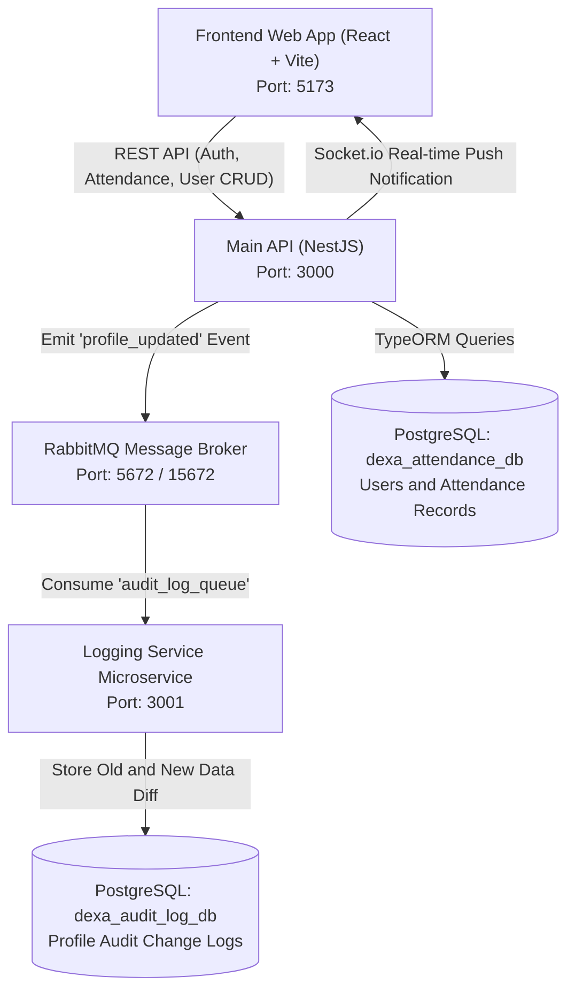

# Dexa Portal - Fullstack Attendance & Employee Management System

Sistem manajemen presensi karyawan dan administrasi HRD berbasis arsitektur *microservices*, *event-driven architecture* (RabbitMQ), serta komunikasi *real-time* (Socket.io WebSocket). Dilengkapi dengan antarmuka web modern bernuansa *enterprise dark glassmorphic*.

---

## 🏛️ Arsitektur Sistem



---

## 🚀 Fitur Utama

### 1. Autentikasi & Otorisasi Berbasis Peran (RBAC)
- Autentikasi aman menggunakan **JSON Web Token (JWT)** dengan enkripsi sandi **bcrypt**.
- Proteksi halaman & endpoint API berdasarkan *Role* (`EMPLOYEE` & `HRD_ADMIN`).
- Tombol *Quick-Fill Demo Account* pada halaman login untuk kemudahan pengujian.

### 2. Portal Karyawan (Employee Side)
- **Presensi Kerja Interaktif**:
  - Jam digital *real-time* berbasis zona waktu **WIB (Asia/Jakarta)**.
  - Tombol aksi **Clock In** dan **Clock Out** instan dengan validasi satu kali per hari.
- **Ringkasan Kehadiran**:
  - 4 kartu metrik kehadiran bulanan (Total Hadir, Hadir Bulan Ini, Sedang Bekerja, Rata-rata Durasi).
  - Filter kustom rentang tanggal presensi.
  - Tabel riwayat absensi dengan badge status (*Selesai*, *Bekerja*, *Belum Hadir*).
- **Pengaturan Profil Diri**:
  - Pembaruan nomor kontak WhatsApp/HP, foto avatar, dan penggantian password.
  - Setiap perubahan profil otomatis mentrigger *event-driven audit log* dan notifikasi Socket.io.

### 3. Dashboard HRD Admin (Admin Side)
- **KPI Monitoring**:
  - Statistik langsung: Total Karyawan, Hadir Hari Ini, Sedang Bekerja, dan Selesai Bekerja.
- **Monitoring Presensi Seluruh Karyawan**:
  - Pencarian nama dan jabatan karyawan.
  - Filter cepat: *Hari Ini*, *Bulan Ini*, *Semua*, dan *Rentang Kustom*.
  - Menampilkan durasi jam kerja terhitung secara otomatis.
- **Manajemen Data Karyawan (CRUD)**:
  - Pendaftaran akun karyawan/admin baru dengan validasi data.
  - Pembaruan informasi jabatan, nomor kontak, serta reset password.
  - Penghapusan akun karyawan (*Delete Employee*).
- **Notifikasi Real-time (Socket.io)**:
  - Admin secara otomatis menerima pesan popup notifikasi (*toast*) secara langsung tanpa me-refresh halaman saat ada karyawan yang memperbarui data profilnya.

### 4. Logging Service & Message Queue (RabbitMQ)
- Pemrosesan asinkron *audit log* menggunakan **RabbitMQ**.
- Service `logging-service` mencatat riwayat pembaruan profil (*oldData* vs *newData*) ke dalam database `dexa_audit_log_db` pada tabel `profile_change_logs`.

---

## 🛠️ Tech Stack

| Layer | Teknologi |
| :--- | :--- |
| **Frontend** | React 18, Vite, TypeScript, Tailwind CSS, Radix UI, Lucide Icons, Sonner Toasts, Axios, Socket.io-client |
| **Backend Main API** | NestJS 11, TypeORM, Passport JWT, Socket.io (@nestjs/websockets), RabbitMQ Client, Swagger OpenAPI |
| **Microservice** | NestJS Microservices, RabbitMQ Transport, TypeORM |
| **Database & Message Broker** | PostgreSQL 15 (Multi-database), RabbitMQ 3 Management |
| **DevOps & Container** | Docker, Docker Compose |

---

## 📦 Pemetaan Port & Layanan

| Service | Port Host | Deskripsi |
| :--- | :--- | :--- |
| **Frontend Web App** | `5173` | Antarmuka pengguna (Vite Dev Server) |
| **Main API** | `3000` | REST API, Auth, Attendance, WebSocket Gateway |
| **Swagger Docs** | `3000/api/docs` | Dokumentasi interaktif OpenAPI |
| **Logging Service** | `3001` | Microservice consumer RabbitMQ |
| **RabbitMQ Management** | `15672` | Dashboard antrean RabbitMQ (`guest` / `guest`) |
| **RabbitMQ AMQP** | `5672` | Protokol pesan RabbitMQ |
| **PostgreSQL** | `5432` | Database engine (`dexa_attendance_db` & `dexa_audit_log_db`) |

---

## 🔑 Akun Demo untuk Pengujian

| Role | Email | Password | Akses Halaman |
| :--- | :--- | :--- | :--- |
| **HRD Admin** | `admin@dexa.com` | `password123` | `/admin/dashboard` |
| **Employee** | `user@dexa.com` | `password123` | `/employee/attendance`, `/employee/summary`, `/employee/profile` |

---

## ⚙️ Panduan Menjalankan Sistem

### 1. Prasyarat
Pastikan komputer Anda sudah terpasang:
- [Docker & Docker Compose](https://www.docker.com/)
- [Node.js](https://nodejs.org/) (versi 18+ atau 20+) & npm

### 2. Menjalankan Backend & Infrastruktur (Docker)
Jalankan seluruh kontainer backend (PostgreSQL, RabbitMQ, Main API, dan Logging Service) dengan satu perintah:

```bash
docker compose up -d --build
```

Pastikan seluruh kontainer berjalan normal:
```bash
docker compose ps
```

### 3. Menjalankan Frontend Web App
Buka terminal baru di direktori `web-app`:

```bash
cd web-app
npm install
npm run dev
```

Buka browser dan akses antarmuka web di:
👉 **`http://localhost:5173`**

---

## 🧪 Pengujian & Verifikasi Alur Sistem

### 1. Verifikasi Swagger Documentation
Buka browser pada tautan:
👉 **`http://localhost:3000/api/docs`**

### 2. Verifikasi Socket.io Real-time Alert
1. Buka 2 jendela browser yang berbeda (atau jendela normal dan incognito).
2. Di jendela 1: Login sebagai **HRD Admin** (`admin@dexa.com`). Buka tab **Kelola Karyawan**.
3. Di jendela 2: Login sebagai **Employee** (`user@dexa.com`). Buka menu **Profil Saya** (`/employee/profile`).
4. Ubah nomor HP atau Avatar Karyawan, lalu klik **Simpan Perubahan**.
5. Pada jendela Admin, notifikasi real-time akan langsung muncul:
   > *"Karyawan Donny Kurniawan memperbarui data profilnya."*

### 3. Verifikasi Audit Log pada Logging Service (RabbitMQ)
Cek log kontainer `logging-service`:
```bash
docker compose logs --tail=20 logging-service
```
*Output menampilkan pesan `📩 Log Event Received:` dengan data lengkap.*

Cek database riwayat audit di PostgreSQL:
```bash
docker compose exec postgres psql -U dexa_user -d dexa_audit_log_db -c "SELECT id, \"userId\", \"oldData\", \"newData\", \"changedAt\" FROM profile_change_logs ORDER BY \"changedAt\" DESC LIMIT 3;"
```

---

## 📁 Struktur Direktori

```text
dexa-fullstack-test/
├── docker-compose.yml          # Konfigurasi orkestrasi PostgreSQL, RabbitMQ, API, Logging
├── init-multiple-dbs.sh        # Script inisialisasi multi-database PostgreSQL
├── main-api/                   # NestJS Monolith Core API
│   ├── src/
│   │   ├── auth/               # Autentikasi JWT & Guard
│   │   ├── attendance/         # Manajemen Presensi (Clock-in, Clock-out, Rekap)
│   │   ├── user/               # Manajemen Profil & CRUD Admin Karyawan
│   │   ├── notification/       # Socket.io WebSocket Gateway
│   │   └── rabbitmq/           # RabbitMQ Client Producer
│   └── Dockerfile
├── logging-service/            # NestJS Microservice Consumer
│   ├── src/
│   │   ├── entities/           # Entity ProfileChangeLog (TypeORM)
│   │   └── app.controller.ts   # Handler @EventPattern('profile_updated')
│   └── Dockerfile
└── web-app/                    # React + Vite Single Page Application
    ├── src/
    │   ├── components/         # Layout & Shadcn/UI Components
    │   ├── context/            # AuthContext (State & Token Management)
    │   ├── hooks/              # Custom Hooks (useSocket)
    │   ├── pages/
    │   │   ├── LoginPage.tsx
    │   │   ├── admin/          # AdminDashboard.tsx
    │   │   └── employee/       # AttendancePage, ProfilePage, SummaryPage
    │   └── lib/                # Axios API Client Instance
    └── package.json
```
